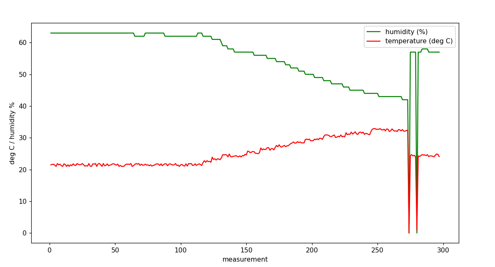

# dht11_app
An embedded project that uses the DHT11 to send temperature and humidity data 
up to a SSL/TLS socket server.

I wrote this to better familiarize myself with secure sockets in embedded 
projects, as well as to increase my familiarity with the esp32 ecosystem.

There is also producer/consumer model for real-time storage of data from the
socket, as well as matplotlib display script.

## Instructions

View the READMEs within the respective projects for topics such as openssl
certificate creation, setting up credentials on esp32, the data format, setting
up platform.io, etc.
